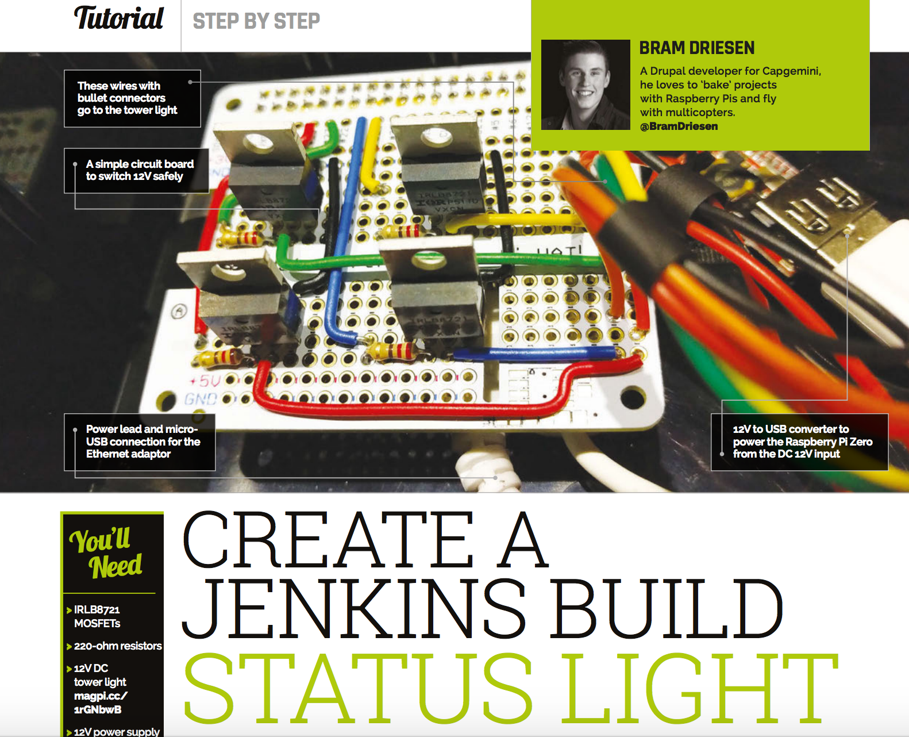

Python script to control a LED Tower light using a Raspberry Pi.

The script has two versions available. The first version of the script is using the GPIO outputs directly which can be used with a custom HAT to switch higher current or directly to switch 3V LED's. The second version is created using the Automation HAT/pHAT library from Pimoroni.

More information about the custom HAT can be found in the `diy_hat` directory.


## Installing

### Automated Installation

```sh
sudo bash -c "$(curl -sL https://raw.githubusercontent.com/BramDriesen/rpi-jenkins-tower-light/master/install.sh)"
```

### Manual installation

Install the [Jenkinsapi][1] Python library
```sh
sudo pip3 install jenkinsapi --upgrade
```

Install the [Automation HAT/pHAT][4] library
```sh
curl https://get.pimoroni.com/automationhat | bash
```

Clone the project in your preferred directory with
```sh
git clone https://github.com/BramDriesen/rpi-jenkins-tower-light.git
```

Copy the default configuration file to config
```sh
cp default-config.py config.py
```

Edit the configuration file with your information
 - Jenkins URL
 - Username and Password.
 - Jobs
    - Needs to be an array even if you have 1 item
    - Supports sub-folders by using a `/` in the name e.g. `folder/job/master`
 - GPIO outputs (only needed fot the DIY HAT)

#### Configuration file for the **Automation HAT/pHAT**
```py
jenkinsurl = "http://example-url.com:8080"
username = "your-username"
password = "your-password"
jobs = ['job-name-1', 'job-name-2']
```

#### Configuration file for the DIY hat (uses the GPIO directly)
```py
jenkinsurl = "http://example-url.com:8080"
username = "your-username"
password = "your-password"
jobs = ['job-name-1', 'job-name-2']
gpios = {
    'red': 18,
    'buzzer': 23,
    'yellow': 24,
    'green': 27,
}
```

Make sure to enable the setting "Wait for network on boot" in the Raspberry Pi config screen. Use `sudo raspi-config` to go to the settings. Also set the configuration to boot into the terminal.

Edit your `rc.local` file to make the script run at boot. Edit it using the command:
```sh
sudo nano /etc/rc.local
```
Using your cursor keys scroll to the bottom and add the following line :

For the Automation HAT/pHAT:
```sh
python3 home/pi/rpi-jenkins-tower-light/jenkins_tower_light_hat.py &
```

For the DIY HAT
```sh
python3 home/pi/rpi-jenkins-tower-light/jenkins_tower_light_gpio.py &
```

Note: If you cloned the directory in a different location be sure to change this path to correspond with your location.

Reboot your Raspberry Pi:
```sh
sudo reboot
```
If successful all lights will blink once, and after a few seconds the status should be displayed. Consult the meaning of each light below.

## Light status
At startup of the scripts all light's will be toggled once.

- Solid
    - Red: Some builds have failed
    - Yellow: Some builds are unstable
    - Green: All builds passed
- Blinking
    - Red: An error occurred (connection or authentication)
    - Yellow: One or more jobs are building

### Features to add / Todo list
- [ ] Improve code (Mainly blinking functions)
- [x] Installation script
- [ ] Web interface to configure the settings (probably not going to do this)
- [ ] Find a use case for the buzzer.

### Extra information
The tower light I am using can be bought from [Adafruit][2] or other resellers that handle Adafruit products like [Pimoroni][3] where I got mine. You can probably also use other types of tower lights but be careful with operating voltages since most of the tower lights are meant for industrial applications.

### Special thanks
A special thanks to the awesome pirates from Pimoroni for supporting this project.


### Featured project
The original version of this project was featured in [The MagPi Issue 46][5]!



[1]: https://github.com/pycontribs/jenkinsapi
[2]: https://www.adafruit.com/products/2993
[3]: https://shop.pimoroni.com/products/tower-light-red-yellow-green-alert-light-with-buzzer-12vdc
[4]: https://github.com/pimoroni/automation-hat
[5]: https://www.raspberrypi.org/magpi/issues/46/
