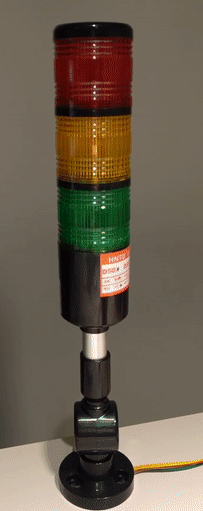

# Raspberry Pi Tower Light
**TODO**: Add logo.

Python script to control a 12V LED Tower light using a Raspberry Pi.

The script is initially created to control a 12V LED Tower light. The script can either be used with the Automation HAT/pHAT from Pimoroni or with the custom build HAT from the initial release of the script. More information about the custom HAT can be found in the `diy_hat` directory. If you don't need to switch high powered LED's you can still use this project with 3V LED's connected directly to the GPIO pins.   


**TODO**: To be rewritten.

The program will use 4/5 GPIO outputs to send a signal to a the main board to switch 12V. More details about the board can be found below. Of course if you would like to add functionality more and/or other GPIO outputs will be used.

If you don't need to switch 12V you can still use this project without any hardware to control 3V leds with the GPIO pins.



## Installing
**TODO**: A install script will be created limiting the use of custom actions like this.


Install the Python [Jenkinsapi][1] package:
```sh
sudo apt-get install python-jenkinsapi
```

Clone the project in your preferred directory with:
```sh
git clone https://github.com/BramDriesen/rpi-jenkins-tower-light.git
```

Copy the default configuration file to config:
```sh
cp default-config.py config.py
```

Edit the configuration file with your Jenkins URL, Username and Password. Set the jobs to be monitored and change the GPIO outputs if needed:
```py
jenkinsurl = "http://example-url.com:8080"
username = "your-username"
password = "your-password"
jobs = ['job-name-1', 'job-name-2']
gpios = {
    'red': 18,
    'buzzer': 23,
    'yellow': 24,
    'green': 27,
}
```

Make sure to enable the setting "Wait for network on boot" in the Raspberry Pi config screen. Use `sudo raspi-config` to go to the settings.

Edit your `rc.local` file to make the script run at boot. Edit it using the command:
```sh
sudo nano /etc/rc.local
```
Using your cursor keys scroll to the bottom and add the following line :
```sh
python /path/to/the/script/rpi-jenkins-tower-light/jenkinslight.py &
```
Reboot your Raspberry Pi:
```sh
sudo reboot
```

## Light status
At startup of the scripts all light's will be toggled once.

- Solid
    - Red: Some builds have failed
    - Yellow: Some builds are unstable
    - Green: All builds passed
- Blinking
    - Red: An error occurred (connection or authentication)
    - Yellow: One or more jobs are building

### Features to add / Todo list
- [ ] Improve code (Mainly blinking functions)
- [ ] Installation script
- [ ] Web interface to configure the settings
- [ ] Find a use case for the buzzer.

### Extra information
The python script has been tested on a Raspberry Pi 3 and Zero using Raspbian Jessie `4.1`.

The tower light I am using can be bought from [Adafruit][2] or other resellers that handle Adafruit products like [Pimoroni][3] where I got mine. You can probably also use other types of tower lights but be careful with operating voltages since most of the tower lights are meant for industrial applications.

[1]: https://pypi.python.org/pypi/jenkinsapi
[2]: https://www.adafruit.com/products/2993
[3]: https://shop.pimoroni.com/products/tower-light-red-yellow-green-alert-light-with-buzzer-12vdc

### Special thanks
A special thanks to the awesome pirates from Pimoroni for supporting this project.

