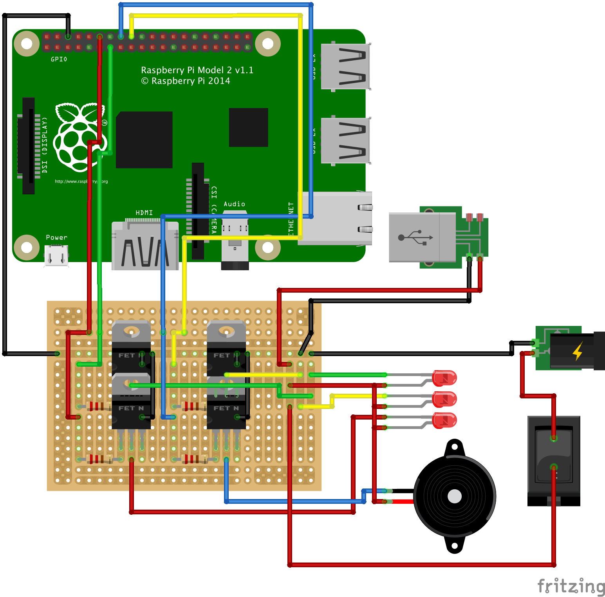
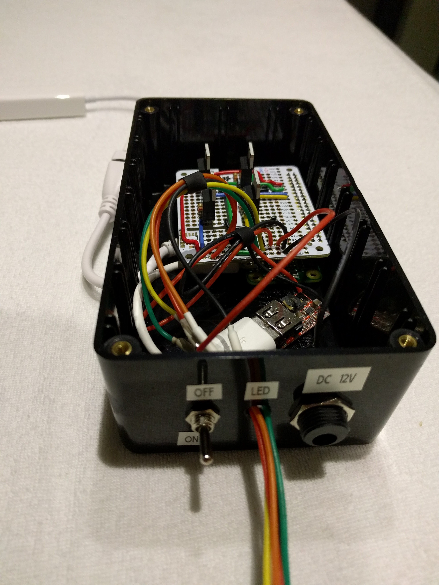

## DIY build hat
The original version of this project contained a custom made circuit board. The updated version uses the Pimoroni HAT/pHAT to make it more accessible to other people that don't have a lot of solder skills. However if you still want to enjoy building your own circuit board you can read the detailed instructions below. 

### Circuit Board
The board is created with a few simple components like 220 Ohm resistors, N-Channel MOSFET's and an Adafruit Perma Proto board HAT for the Raspberry pi.

Below you will see the component layout in Fritzing. I re-created the Perma Proto HAT board so I could have an accurate as possible layout of the component. This made the transfer to the physical board a breeze!

The original Fritzing files can be found in the `fritzing` directory.

The finished circuit board attached to the Raspberry Pi zero inside of the enclosure.

The enclosure before closing everything up with all the switches on front. The white calble to the left is the micro-USB to USB with an Ethernet to USB connector plugged in.

Schematics and Fritzing files can be found in the `/fritzing` directory and all the images in the `/images` directory.

### Components used
- 4x N-Channel MOSFET (IRLB8721)
- 4x 220 Ohm resistor
- 4x Bullet connectors (3mm)
- 1x Adafruit Perma Proto HAT
- 1x Adafruit 12V LED Tower light
- 1x On/Off switch
- 1x DC Barrel power jack
- 1x 12V To USB converter
- 1x DC 12V Power adapter
- 1x Project enclosure
- Velcro tape
- Heat-shrink tubing
- 22AWG Solid copper wire
- 26AWG Flexible wire